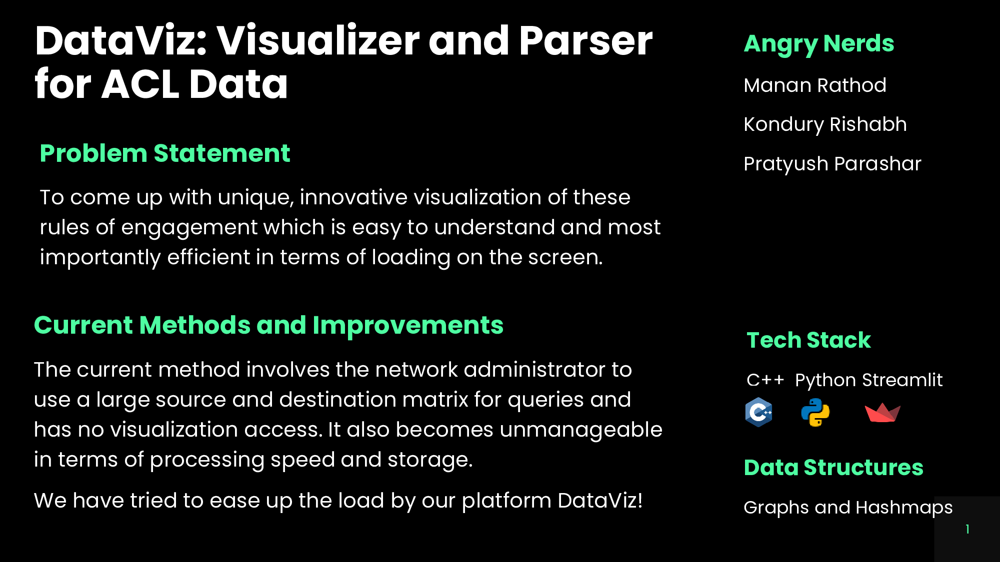
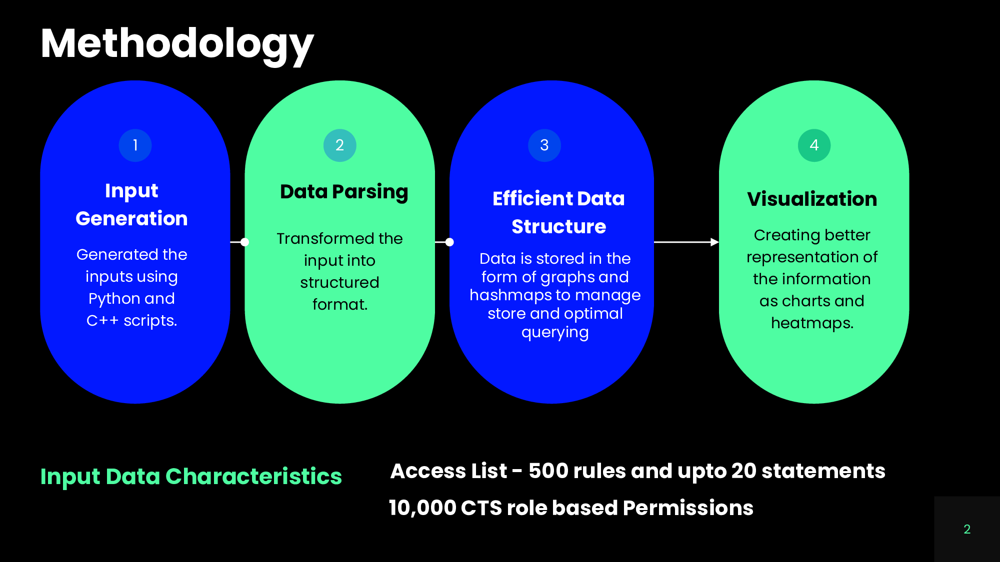
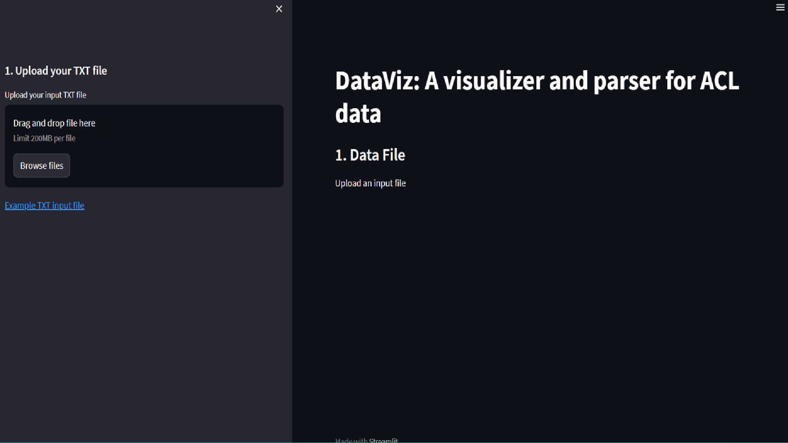
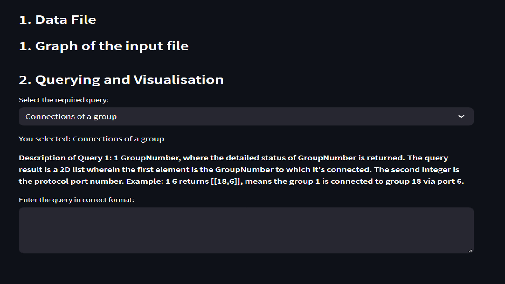
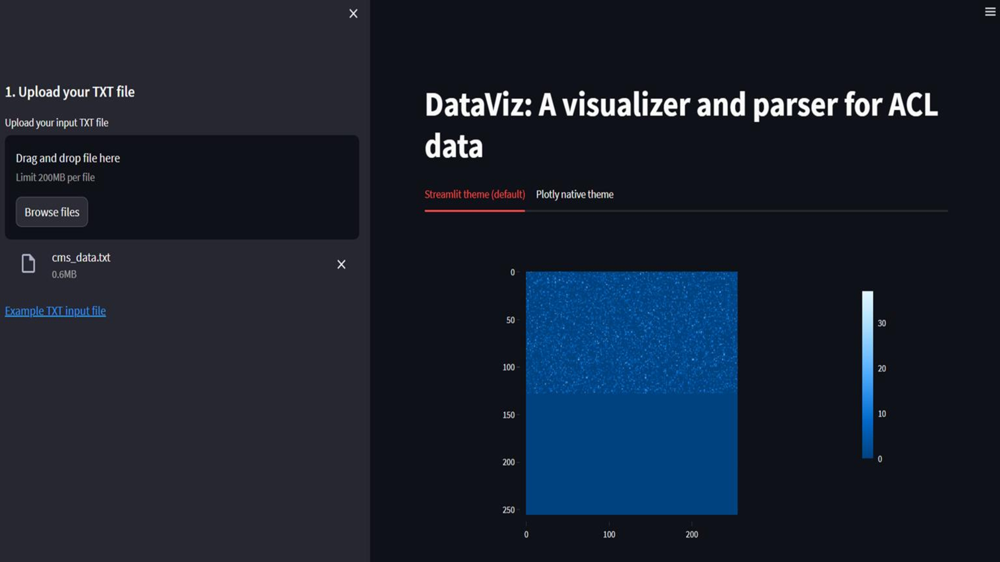
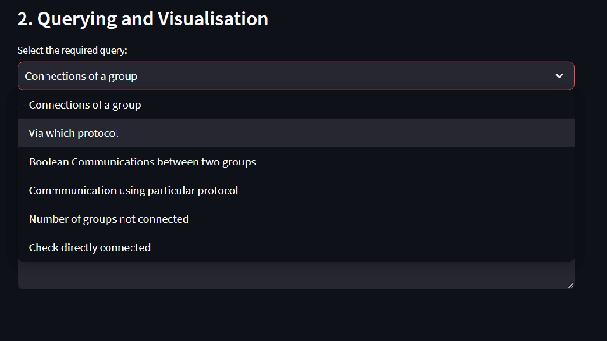
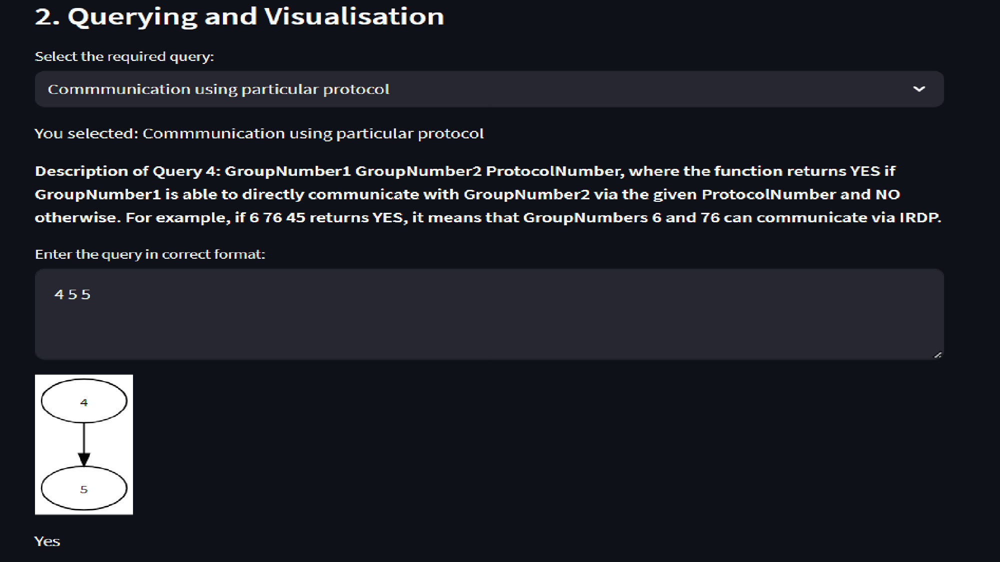
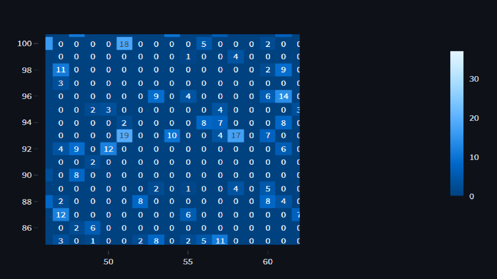

# DataViz by Team Angry Nerds

## Problem Statement, Tech Stack and Data Structures

 

## Methodology

 

## Screenshots

### Home Page of DataViz

 

### Queries along with Descriptions

 

### Heatmap Visualization of ACL Data

 

### Types of Queries regarding ACL Data

 

### Query Processing and Explanation of Outputs using Visualizations and Charts

 

### Customised Heatmap with Annotations which depict the number of edges from GroupNumber

 
